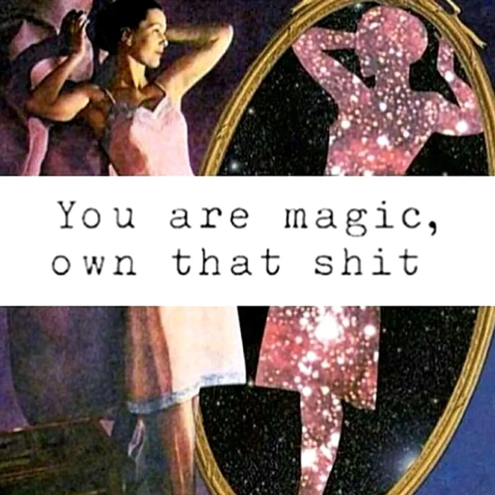

# Being funny is not just a coping mechanism

Lately I’ve been dealing with a new stage of my anxiety: anger. I go from 0 to 100 in the split of a second, no matter how small or big the issue at hand is. The good thing is I don’t lash out, I just bottle up my anger and put it aside for later because it’s my responsibility to deal with my anger and the issues that cause it. The bad thing is my pulse is going through the roof about 5 times a day (when I get angry). So I probably gathered the equivalent of a fully stacked bar filled with anger bottles by now - but that’s a juicy story for another time.

The latest thing that annoys me is hearing people judging my sense of humour, and trying to guess why I’m funny. “You know you don’t have to smile or be jolly all the time, right? Be the real you.” Or stuff on the lines of “humour is just a coping mechanism for you. Have you ever tried not adding humour to your stories?”. Sure, I can empathise with the logic behind these judgements. I did my fair share of research when it comes to the psychology of using humor as a coping mechanism and I know it’s a real thing.

Indeed, I have also used humour as a coping mechanism in the past, particularly when I was growing up. The thing is I always loved grammar, words, languages and laughter. So I thought, why not combine all the above? This love has evolved into a passion for writing. I knew I was creative, smart with words and I also loved comedy and jokes a lot. Whilst I fell into the thrill making others laugh, and using humour as a coping mechanism, this transcended into a real passion for comedy.

From stupid things I said as a child, I moved on to writing funny vulgar poetry. To do so, I was using words I couldn’t comprehend (at that time) just because they rhymed, and it made people laugh. I used to memorize whole books of jokes on different topics, just so that I had a joke for any moment, any subject. 

After I finally had an internet connection of my own, around 2010, I started to consume a lot of mainstream humour every day - from memes, to funny gifs, to shows with comedians, sketches, and all sorts of comedy. In the past 9 years, I never went 24h without watching something funny and learning how to level up my jokes from it.

In adolescence I developed a dark, twisted and vulgar sense of humour because it was very easy to make people laugh using these type of jokes. Nowadays, my humour is more like improv - I just listen to what people say and put a funny twist on it. Sometimes I still go for dark or vulgar, but only after people from a new group know me a little bit, because I don’t want to be creepy or come off as inappropriate. 

I also had a go at writing and filming a comedy sketch, and made quite a few memes over the years based on my real life experiences. I know now that I’m a natural when it comes to humour, and I don’t do it for the instant gratification. Firstly, I do it for me - because it brings me tremendous joy to twist words and create a new context where a joke can be born.

Secondly, I do it because laughing connects me to other people. And my jokes can make someone’s day better. I can’t save you from the hardships of your life, I can’t take your pain away, I can’t make you feel less stressed. But I can tell you a joke and help you forget about all the bad things you’re going through for a few minutes (does this sound like a prostitute’s paper ad?).

So yes, when you tell me to “be the real me”, “stop smiling”, “don’t make jokes” you are actually diminishing all the work I have done over the years to become the funny person I am today. Humour is a craft, it’s not just a coping mechanism. 

The real me is hilarious, honest and polite. Being nice doesn’t mean I’m not “the real me”, it means I see a lot of shit and awful behaviour around me, but I prefer to be professional rather than act like the cast of Mob wives, flipping tables, insulting people and getting into cat fights. 

And what the hell is wrong with smiling a lot? I often smile on my own like a crazy person because I have inside jokes going on in my head. Sue me!

I  guess the main message I’m trying to send here is that it’s very easy to judge people. It’s very easy to put them in a box. It’s also very easy to be blinded by our own fixed ideas and think that you are super empathic and super wise and that’s that. But how about accepting people you don’t understand for who they are? If you eventually vibe with them, they will show you more of who they are. But if you keep trying to shove them in a box made your own prejudices, you will just make them write an angry blogpost at 11pm.