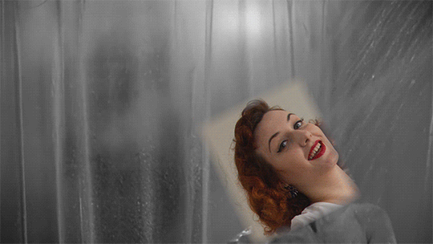

# Blood, sweat and tears: my wisdom teeth removal story

I don’t know about you, but if I wake up to pee in the middle of the night, the chances are I will not be able to get back to sleep. When I sleep, my mind turns into a vortex where dozens of thoughts spin simultaneously - both positive things and anxiety inducing things. If I become aware for a few minutes, the thought I might land upon when gaining consciousness might be soothing - which helps me return to a sweet comforting sleep afterwards. Or it might just be the latest anxiety inducing thought or thing that makes me angry - and in that case, my brain is like “hell no, you’re not going back to sleep. You’re awake now and I’ll give you enough energy to ruminate for hours about a stupid illogical thing”.
So yeah, I woke up at 3:30am, it’s 5:47 am and I couldn’t fall back asleep so I guess this is the perfect time to tell you the story of my wisdom teeth removal.

<figure>
    
    <figcaption>Me vs. the Dentist</figcaption>
</figure>

Money anxiety has been deeply rooted in me since I was a child, and for this reason I didn’t go to a dentist for more than 10 years, because somehow I preferred to hang on to the idea that not spending money is more important than my oral health. I finally gave in (no need for applause, really) and I went to the dentist, fixed what needed to be fixed and scheduled the most dreadful thing (in my mind) - a wisdom teeth extraction.

## Pre-Extraction

I postponed and delayed the surgical removal of my teeth for as long as I could. After I finally managed to schedule it, I asked everyone that I knew had a surgery done at any point in their life, things like “How did you prepare for your surgery?!, Were you afraid? How did you cope with fear? Did it hurt?”. The answers I received varied from “I knew I had to do it eventually so why stress about it?”, “You just do it and get it over with” or “Oh, you won’t feel a thing, I haven’t felt a thing it’s so fast and easy”. I don’t know what answer I was looking for, but none of these were “it”. So I tried to motivate and encourage myself by changing my thought pattern - I would think things like “my friends went through painful C-sections, uterus removal, cancerous tumour removal - and you’re shitting your pants for this?”. I also watched dramatic youtubers exaggerate their teeth removal story for ad money but that only stressed me out more. Don’t worry, all my efforts to calm myself didn’t work - so I succumbed to desperation, anxiety and playing torture scenes from movies over and over again in my head until the day of my surgery.

## The Day of the Surgery

I imagine this is never a fun day for anyone, especially for those like me who never had any type of surgery in their lives. All those hours before my appointment, I kept thinking that I would do anything in the world not to have to go through this. After feeling sorry for myself, I kept trying to think how awesome it will be, and how relieved I will feel when I’ll walk the fuck out the dentist’s door. But then I would return to the torture scenes, playing those in my head over and over again, and then back to the image of me walking out of the dentist’s door.
As I was getting closer and closer to the dentist, I kept thinking “You don’t have to do this. You can postpone it forever, cancel the appointment last minute, walk away.”  It would have been easy to chicken out, but I knew I have to keep walking no matter how much I dreaded what was going to happen.

## The Surgery

I walked in the dentist’s office, feeling as if I knowingly agreed to be tortured *self pity intensifies*.

My teeth surgeon is a very successful and skilled doctor - she went to Med School twice (so that’s 12 years of University) and also has a very long CV full of accomplishments. In theory, I knew I was on great hands - but that’s not why I was scared and stressed.
I was scared because I had to go into unknown territory and feel things I never experienced - teeth extraction, sewing the holes left by my teeth and strange uncomfortable sensations in my mouth in the following  2 weeks.
The first wisdom tooth was out in less than 10 minutes  - which was awesome! I had anaesthetic injections so I didn’t feel a thing.
The second one? Let’s do an imagination exercise. Close your eyes and picture yourself in a Tom & Jerry episode. Now picture Tom pulling a door with his hands and feet, frustrated, trying to get it open to catch Jerry. No matter how hard he tries, he’s barely budging the door. He tries to cut the door open with chainsaws and tools, for 2 hours. Finally, after working hard for so long, he manages to open the door. Now, come back to reality - Tom was the dental surgeon, the door was my wisdom tooth.
This whole experience wasn’t horrible, it was more unpleasant and tiring - it’s not fun to feel like someone could potentially dislocate your jaw, nor to keep your mouth open for 2h.
But hey, I had so many anaesthetic injections, I  didn’t feel how she was cutting into my jaw bone.

## The Aftermath

I can’t tell you how happy I was to fuck off as soon as the surgery was done. I was given an ice pack, mouth care instructions, a drug prescription and the recommendation to return in two weeks for the surgery thread removal. I kept icing my face for the next days, take the prescription drugs and trying to ignore the unpleasant tingling of the long ass thread the doctor had to leave in after sewing the hole in my mouth. My face didn’t swell too much, so that was nice. I only ate on one side of my mouth for 14 days and panicked whenever any food wanted to make its natural way to the other side. Eating took me much more time than usual, because my jaw was a little clenched from the trauma it suffered (cutting into the bone) so chewing was painful for a while. After two weeks, I went back, they took out the tread and sent me on my merry way.

## Conclusion

1. I survived! And you will too!
2. Everyone’s experience is different, so reading/listening to other people’s wisdom tooth removal experience won’t actually provide you with much information to work with.
3. Not knowing exactly everything that happens is a plus! You would just worry for things that are not actually that unbearable or painful.
4. If you’re going to hell, keep going! Try to be as optimistic and calm as you can. Maybe you won’t be able to do so at all, but the most important thing is to go through with it even if it’s scary, even if it makes you wanna chicken out really bad.
5. Practice what you preach! I kept preaching to everyone “you should see a doctor for that”, “you should never postpone a medical check/ procedure”  - so I knew that chickening out is not an option. You need to lead by example, and encourage others to do so if you want to see people improve and live a better, healthy life.
6. Postponing the extraction of the wisdom teeth can have bad consequences in the future. You don’t want to be in excruciating pain and praying for death when you decide to go through with something you should have done years ago.