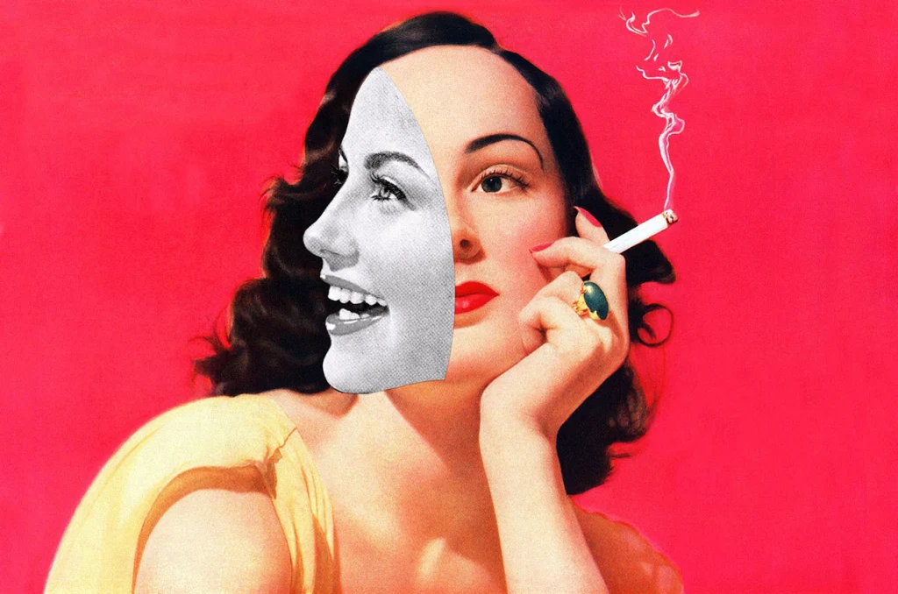

# What's the deal with toxic people?

<figure>
    
    <figcaption><a href="https://cargocollective.com/eugenialoli">Artwork by Eugenia Loli</a></figcaption>
</figure>

As we grow older and wiser, our ability to identify things that are not good for us grows, too. We find clearer labels for our emotions, our patterns, our mental health issues. And when it comes to feeling like life was sucked out of you after spending time with a specific person, you start to connect the dots and realise that this particular person is toxic for you.

I’m a firm believer that there is still some good in toxic people - I don’t think they are evil or mean at heart. I just think their inner hurt, their trauma or insecurities were swept under the rug for too long, and their refusal or fear to start dealing with these things hasn’t stopped the process of pain eating away at their soul.

<blockquote>

<a href="https://psychcentral.com/blog/whats-a-toxic-person-how-do-you-deal-with-one">“It’s not that the whole person is toxic. Rather, their behavior is toxic or your relationship with the person is toxic.” - Jodie Gale, MA - Psychotherapist</a>

</blockquote>

From my experience, such people find it hard to honestly acknowledge how they feel or own up to a serious mistake. It’s fairly easy for them to apologize or own up when it comes to little things, but not in situations where it would actually make a huge difference. Toxic people are usually unaware that all their emotional baggage comes out in their behavioural patterns, and therefore affects others. 

I personally know many toxic people that are good people & fun outside the environments where I have to deal with their otherwise toxic behaviour. Although I can see they are ambitious, smart and talented, it doesn’t mean that I should tolerate how they act when, like the [scorpio stings the frog in the fable](https://en.wikipedia.org/wiki/The_Scorpion_and_the_Frog), they just can’t help but make my life a living hell. 

Such people also lack empathy, tact, consideration for others’ feelings or emotional maturity. Their pain and insecurity makes them prey on others in an attempt to feel better and heal their wounds. Of course, that’s like putting a band-aid on a broken leg and calling it a day! Your niceness, willingness to listen and comfort them always backfires because it’s usually a one way street. And in the end, you are left there physically and mentally exhausted, not knowing what to do. Their personal charm is also hard to ignore, and they always want to be the center of your adoration and attention - which wouldn’t be that disturbing if it would be the result of hard work. However, it’s usually at the expense of other people’s wellbeing.

A few years ago I was friends with a girl that I met through work and our friendship continued even after we moved on from the company we worked at together. At that time, I was unemployed which made me more vulnerable emotionally - my anxiety was high and my insecurities were getting the best of me. I used to talk often on the phone with this friend (as I had moved to another city) - she was a smart, kind and funny woman, a little older than me, and we had many things in common - including a fucked up childhood, growing up poor and not having much luck in life. So, naturally, we found solace in each other’s misery. She was also unhappy with her career path and wanted to do better, just like me.

This friendship was valuable to me and this made me ignore the red flags when things went south. I started to feel like all our conversations were about HER and HER misery, and there wasn’t enough room for me anymore in that friendship. She kept going on and on about the things that sucked in her life, and rarely owned up about all the ways she was sabotaging herself or allowing others to walk all over her. My friend was always the victim in all circumstances and, therefore, our conversations became long repetitive loops. I tried many times to explain to her that she is sucking the life out of me with her behaviour. It looked like she understood, apologized and sometimes started to cry, but it wouldn’t take long for her to go ahead and do it all over again. After each phone call I felt so emotionally and physically drained, and also felt bad about myself - because whenever I showed any signs of optimism regarding what was going on in my own life, she made sure to poo poo on that too. Basically, I was investing so much time and energy into this friendship to comfort her, lift her spirits, offer a shoulder to cry on and try to help. But instead, I was bringing someone else’s toxicity into my life and that was starting to poison my life. I’m talking about feeling mentally drained, exhausted, annoyed, insecure and overwhelmed moments after talking to her.

I’m not someone who takes [breaking up a female friend lightly](2020-03-11-female-friendship-break-ups.html), but I knew I had to do something about this. As all my attempts to improve our communication and friendship have failed, I had to take the painful decision of ghosting my friend because she was toxic for me, and caused my mental health issues to take a turn for worse. Whilst I can’t say it was the most polite approach, it was definitely something I needed to do for my own wellbeing and, years later, I still have no regrets about this decision.

<blockquote>

<a href="https://www.urbandictionary.com/define.php?term=Toxic%20Person">“A toxic person is someone who goes through every length to make another person feel bad about themselves and make it seem like they are the person who is better.”</a>

</blockquote>

Toxic people can be anywhere - in your own family, at work, among friends or acquaintances. If you learn to identify and respond better to their toxic behaviour, it can help you preserve your energy and protect yourself from a lot of emotional and physical distress.

There are many toxic people you can’t ghost - for example a vital relationship at work(your boss or a colleague), a parent, a sibling, a longtime friend. However, that doesn’t mean you shouldn’t [be your own person](2020-03-11-be-own-person.html), set boundaries and protect yourself against the effects their behaviour has on you. 

There are elements of my father’s and my brother’s behaviour that are toxic to me and affect my mental health, so I drastically reduced contact with them and I try to stay away from their drama with each other. Our relationship was always superficial and they seem to get in touch mainly when they need something from me, and the only option for me to still have them in my life was to learn to accept that while limiting contact. Since I reduced contact, I feel better about myself and like that I can finally live my life the way I want to, without putting my self-worth in their opinion of me or be affected more than necessary by their lack of emotional support.

[Working with toxic people](https://www.wikihow.com/Deal-With-Toxic-People) is a different story and can be a tougher one, if you don’t plan on quitting your job anytime soon. Whilst I have been able to avoid certain toxic people and reduce contact due to switching to a new role within the same company, I quickly realised that I exchanged a set of toxic people with another. 😂 They’re everywhere! And believe me that it’s not fun. But my approach is to keep a keen eye on them and analyse all our interactions to learn more about them. Yes, they still set me on fire now and then, but sometimes I manage to keep my emotional response in check and not be affected by the toxicity. By now, I think I have a pretty good understanding of how they think and why they choose to be toxic. But, at the end of the day, only I have the power to change how much their toxicity will affect me.

It’s a matter of always adapting and learning how to manage the negative effects of having to work and collaborate with certain people whose behaviour is gut wrenching for you. There is always room to improve the way I communicate, approach and expand my “jerk handling” skills. The secret to dealing with toxic people is to stop feeling sorry for yourself, complain less and get cracking with learning how to deal with each person in particular. 

You shouldn’t tolerate poor behaviour but remember that only YOU can change your situation. Don’t expect anyone from your workplace to jump in and dole out justice - there are politics and business interests involved and, unfortunately, you are just a pawn on their chess table. Yes, people in charge will feel for you, but that doesn’t mean they will lift a finger to make your life better. From a business point of view it’s more profitable for jerks to be allowed to do what they want in the workplace because it would cost too much to replace that person.

That being said, to survive in this dog eat dog world, you’d better figure out what is the best approach for you to deal with all the challenges toxic people might bring your way. Here’s a few tips:

- Always put your wellbeing first when dealing with such people
- Be honest and express your expectations to them
- Set new boundaries or reinforce older boundaries 
- Observe their behaviour patterns & learn how to protect yourself 
- Avoid/reduce contact with them on purpose (if you can) 
- End the relationship if it turns out to be too toxic for you
- Take ownership of the fact that only you can change how much power you allow toxic people to have over you

Whether we like it or not, toxic people will always be part of our lives - one way or another. They will never change, and even if they do, you may no longer be in their life to see it. The only thing we can control and change is the way we respond to toxic behaviour from others. I encourage you to experiment with different approaches and see which ones work best - you might be surprised how simple it can be sometimes to draw some lines that toxic people (hopefully) won’t cross again with you. If they do, reinforce your boundaries and keep looking for new ways to protect yourself.

If you have any tips or a specific approach to dealing with toxic people, I would love to hear about it!