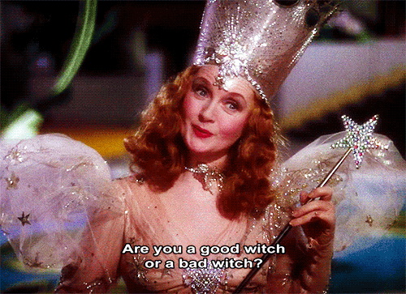

# Why You Should Embrace Your Inner Bitch

I don’t know about you, but I love thinking of myself as a “badass bitch”. I’m no “[boss ass bitch](https://www.youtube.com/watch?v=N6ihCQZK-r0)” yet as the song goes, because that would imply that I’m doing well financially, which is not the case - but I’m definitely on my way to get that coin 😂. I’m not good or bad either - I am just versatile enough to know what kind of bitch I need to be given a particular situation. However, I’m always cautious to not be a bitch unless it’s absolutely needed, because this superpower must be used responsibly.

<figure>
    
    <figcaption><a href="https://en.wikipedia.org/wiki/Glinda">Glinda, the Good Bitch - Wizard of OZ </a></figcaption>
</figure>

Whenever I deal with challenging people or situations, I turn to songs about “being a/that bitch” written or performed by women for women - [Doja Cat - Boss Bitch](https://www.youtube.com/watch?v=RsW66teC0BQ), [Beyonce Ft Nicki Minaj - Flawless Remix](https://www.youtube.com/watch?v=56qgO0C82vY), [Qveen Herby - That Bish](https://www.youtube.com/watch?v=y-3unYek7XA), [Lizzo - Truth Hurts](https://www.youtube.com/watch?v=P00HMxdsVZI); to name a few. I love how these women took a derogatory term and turned it into an empowering one, and I applaud their courage and the way they unapologetically speak their mind. Such anthems are empowering, uplifting and inspirational - and I’m here for it.

The word “bitch” has been used for years to describe “unkind, unpleasant” women. Yes, there are many types of bitches out there - the ones who manipulate others to feel better about themselves, the weak ones, the mean ones. But what about the bitches who are strong, ambitious and outspoken? That, my friends, is a scarry, intimidating concept for some men. Why? Because it took centuries for women to “earn” the right to have opinions, speak their mind, ask for what is rightfully theirs, get to have power to decide what to do with their bodies.

> "I was asked to go in is because I’m a woman and I must know a lot about crying."

Back when I used to live in Bristol I worked at a corporation alongside some male team leaders. I was an office admin and we were all reporting to the same boss. One day, one of the team leaders came to me for help because a woman on his team broke down crying in a one on one. I can’t remember exactly why she was crying - I think it was a family tragedy that affected her so badly that she couldn’t “keep it together” at work anymore. He asked me to go in there and comfort her because he “doesn’t know how to deal with crying”. So I went in because I felt bad for this woman and also wanted to help him. I comforted her, listened to her and advised her to talk to HR. I’m pretty sure the main reason I was asked to go in is because I’m a woman and I must know a lot about crying, right? 😂 I mean the assumption wasn’t that far off, but now that I am a team leader myself I know that your first thought shouldn’t be to run and ask others to help in matters that concern your team. You have to tackle these challenges head on and try to help your team member. And only if that fails, you seek guidance upstairs and follow the subsequent procedures. 

Since I returned to Romania I noticed that my male bosses have a tendency to be more accommodating to male employees. I know that “there’s no room for feelings in business” but I felt on more than one occasion that I wasn’t treated equally. And it’s a very subtle and unintentional behaviour that bothers me. Same goes with the salary - even if I prove I work twice as hard, and my work exceeds the results of my male counterparts, I still don’t earn as much. And when I ask for the money I deserve, I have to pull out lots of evidence to sustain my claims - whilst my male colleagues don’t have to do that as much. Their “professional fame” and “glory” is enough, but mine isn’t.

> "I was raised to fear being labeled a bitch."

I don’t think it’s an intentional thing, but honestly I’m tired of this excuse and IDGAF!  I’ve reached a point in my life where the fact that someone didn’t intend to not treat me equally, give me the same opportunities or show more respect just doesn’t cut it. I must admit - these experiences left me with a sour taste, and I realised that in the future I’d really like to work either under female leadership or just be my own boss. 

I was raised to be polite, selfless, kind, enabling - a good girl that bravely takes insults on but doesn’t say anything back because I’m always supposed to take the high road in a situation. I was also raised to not ask for what I deserve - such as my rights, or a bigger paycheck, even if I work twice as hard as certain male counterparts. And if I ever gave my word for something, I’m supposed to honor it even if I’m taken advantage of, bullied or disrespected by doing so. It goes without saying that I was to fear being labeled a bitch, and to continuously seek validation from men in a way that disregards what I bring to the table.

Most people in my family were raised to automatically see and treat men as superior without question, even in situations where that claim is not backed by anything. For example, my dad is always more accommodating with my older brother, he’s always concerned about him, supports him financially, enables his toxic behaviour just because he’a a man. But in my case, my dad stopped supporting me in any way many years ago and despite the fact that I was the overachieving child, the more educated and ambitious one, the broke AF one - nothing I did impressed my dad enough for him to give me approval or at least some credit. Unfortunately, I know this is not an isolated case. There are many families out there where girls are looked down upon no matter how many things they achieve, just because the boys are considered “the family successor”, “the man of the house”. Yes, that sucks a lot and it’s a hard pill to swallow when you know the men from your family will still see you as less than them for the rest of your life. But despite knowing this, I won’t ever stop fighting for my rights and speaking my mind, even if they will never truly “hear me” or acknowledge my value.

> "No job, and no boss, is worth you diminishing your light, making yourself smaller and keeping your mouth shut."

When it comes to the workplace, up until 2 years ago I was “a good girl”, letting my work speak for myself and, instead of speaking my mind, I was just swallowing my words in order to not “bother” certain men who were acting unprofessional towards me and others. But at some point, I just couldn’t sit back and let them walk over me anymore. So I started to fight back, stand up for myself and ask that my employee rights are respected - I was still polite and nice, but, as you can imagine, my boss didn’t like the idea that he doesn’t own me and that I’m not his slave. This [new found courage got me fired](2020-03-11-unfairly-fired-dream-job.html), and what I learned from this nasty experience is that no job, and no boss, is worth you diminishing your light, making yourself smaller and keeping your mouth shut only because it makes others uncomfortable.

Being ambitious, strong and outspoken is not an easy thing. Since I started to be more vocal and less afraid to voice my opinions in the workplace, I’ve also experienced some unpleasant things. Some people are intimidated by me, others try to shut me up even though I provide pertinent arguments. I also get stabbed in the back more than ever before and I’m sometimes bluntly ignored in meetings, as if no one heard what I just said. It baffled me to observe how speaking up, trying to improve things and being fair are not things openly accepted by people in key positions. And it’s not because I’m crazy, it’s because if it works in a certain way, why should they invest time and energy to improve anything? So I think this is related to not being in the right environment for me, one that allows me to grow, elevate my surroundings and help others more. As a word of advice, when you hunt for your next job, keep in mind that even if it sounds like a place that is 100% amazing, accepting of diverse personalities, with a lot of room for growth, it might not be more than good marketing. Because everyone wants the best people for their company and to get the most out of someone without a pay increase, but few people really want to pay you what you deserve. 

My advice to you is: __don't wait for people to give you respect, to acknowledge your worth, to give you a pay rise, to give you power of decision__. You have to fight for what’s yours, to work twice as hard and claim your place under the sun, and to clap back at haters. Be tough, ambitious, brave, loud, funny, kind, supportive, loving, if that’s the woman you want to be. And if that makes you a bitch, well, there’s two of us!