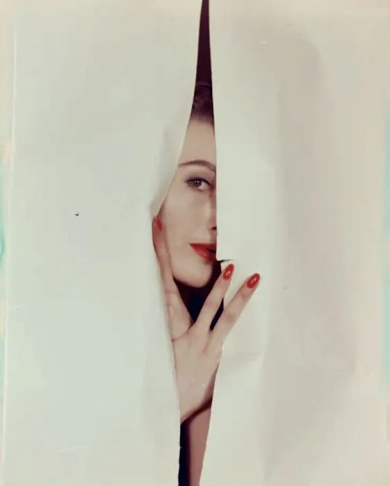
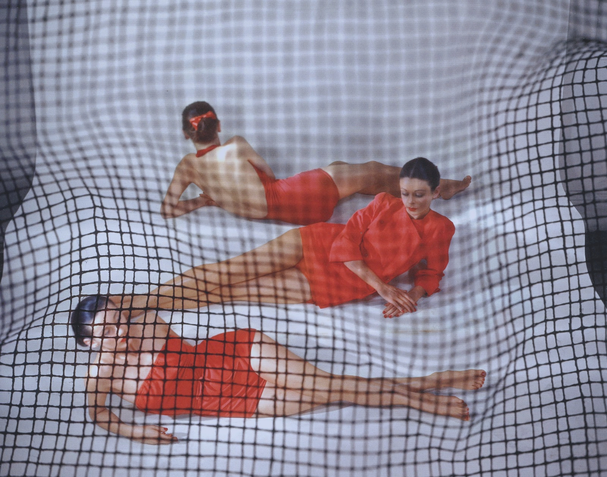

Time flies when you’re too busy being burned out and anxious, am I right? 😂 I’ll just go ahead and call myself out now for not posting anything in here for 5 months. Truth be told, this year has been a big blur for me because I’ve spent most of it in survival mode.

<figure>
    
    <figcaption>Photo by Erwin Blumenfeld</figcaption>
</figure>

When I’m in survival mode, I don’t function as usual. I don’t eat regularly, rest, and take care of my mind enough. I don’t exercise much or do things that bring me joy. Instead of letting my creativity out, which is important for my mental health and wellbeing, I just keep piling ideas in my head until it looks like a browser with 100 tabs open at once and do nothing to bring those concepts to life. My hobbies, creative projects, and interests are left hanging and become haunting concepts that keep nagging me in the back of my mind.

Naturally, I haven’t paid much attention to my anxiety levels either and things spiraled out of control. Therapy gave me the tools I needed to keep it in check, but I didn’t use much of those tools in months so here we are.

Back in February my dad almost died of a transient ischemic attack (stroke), then the COVID-19 pandemic started, then another loved one almost died (not covid related). On top of these things I haven’t been doing well myself both mentally and physically – I feel like I’ve spent more time in burnout and dealing with crippling anxiety than I spent out of it.

And I really can’t say I’m doing much better now. Aside from being exhausted, spiraling down into overthinking and anxiety so low that I can almost see petroleum sources, being stuck in a toxic environment, haunted by all the creative projects I didn’t work on, dreams I didn’t chase, and a clash between where I am and where I want to be, I can still see a light at the end of the tunnel.

> You might ask – “And what exactly is that?”. It’s the fact that even if you can’t control external factors, you can control how you respond to them.

It’s also worth noting that having a roof over my head, food (and coffee!) on my table, a wonderful boyfriend – all aspects that I’m very grateful to have and should be enough of a nudge to make a conscious decision once again to pick myself up and swing from survival to thriving mode.

So we’ve already established that I haven’t done myself any favors by staying so long in survival mode. Looking back, I am once again faced with the consequences of my (in)action when it comes to things I could have done to make life easier for myself. I also see a pattern of things I do to cope on my way out of survival mode and that’s what I want to share with you today.

The premise of this article was to write a “pick me up” piece whilst I’m still down in the trenches, which is hilarious to me. And who knows, maybe reading something like this might be soothing or helpful for someone else.

<figure>
    
    <figcaption>Photo by Erwin Blumenfeld</figcaption>
</figure>

## Do the bare minimum, but do it well

I’m 28 years old and still don’t know exactly what it means to do the “bare minimum”, but at least I know how to do (some) things well by now, so hear me out. Take a deep look in the mirror and be honest with yourself – if it’s barely the middle of the week and you don’t have an ounce of energy left to deal with life and work, it’s time for a reality check. When you’re not ok, you can’t pretend you are and keep up with everything you normally do in a week.

Make a to-do list for the remaining of the week containing your “normal” tasks, commitments, activities, and things that are stressing you out right now. If possible, break them into a few actionable steps, so that you know roughly what you need to do. Ruthlessly divide everything into “urgent and important”, “important but not urgent” and “not important and not urgent”.

Each morning, pick from these things as you go, starting with the “urgent and important things”, and start solving the actionable steps one by one.  Of course, be realistic – don’t do more than you can handle in one day.

Planning and writing things down will help you declutter your mind. Doing things and ticking each off this list will make you feel better because you’ll feel closer to finishing all you planned to finish.

Last but not least, let’s not forget the “do it well” part of this advice. This list will help you gain some mental space and probably spare some precious energy (you know, the one you would consume feeling like shit because you’re behind with everything). Considering you are doing less, try to give each item from the list your best and “be present” mentally when performing those actionable steps. Otherwise, it can all backfire and bite you in the ass – and that’s the last thing you need when you’re already down – more crap to deal with.   

<figure>
    
    <figcaption>Photo by Erwin Blumenfeld</figcaption>
</figure>

## Sleep, Rest and Relaxation

These are things every human needs in order to function properly and avoid burnout or our mental health spiraling out of control. Yes, you can wing it for a while even without getting enough sleep, rest, or relaxation – but sooner or later, neglecting your low energy and low creativity reserves will always backfire.

We all need some time to just be, without focusing on our regular responsibilities or current problems that need solving. Naturally, whilst you’re busy prioritizing everything over your own wellbeing, life also happens. More often than not life will kick you when you’re already down and burned out – and that hits twice as hard.

As someone who spent this year mostly in burnout and crippling anxiety and been served plenty of lemons by life in a short amount of time, I can confirm I would have probably been hit less hard if I had not been ignoring my need to sleep, rest and relax.

I’d love to say this is the first year I’ve done this survival-mode marathon, but the truth is, I’ve been at it for years and still haven’t properly learned how to manage it. I already knew that depleting my energy and creativity resources is dangerous for me. I also knew that eating properly, sports, hobbies, relaxing activities, alone time or socialization with friends fills me up with a lot of energy and motivation. Reading, writing, learning, listening to music spark my creativity and inspiration. But my survival mode blocked any desire to do these things so I just reverted to my natural state of being a sad, anxious, stressed, frustrated, and burned out couch potato.

Especially now when so many of us have the luxury of working from home, I want to encourage you to listen to your mind, feelings, and body and choose to do things that help you feel better and bring you joy because you surely need some of that right now.

> If you work from home, you can always decide to take time for yourself before/during/after work. Even if it sounds bananas, you would be surprised how good you feel after doing something for yourself. The more you do for yourself on a daily basis, the better you will feel. 

Here are a few go-to places online, that help me get in a better mood:

- Light Reading: [Smarter Living (Newsletter)](https://www.nytimes.com/newsletters/smarter-living), [Work Culture (Blog Section)](https://blog.dropbox.com/topics/work-culture);
- Memes: [MyTherapistSays](https://www.instagram.com/mytherapistsays/), [Psychomedy](https://www.facebook.com/PsychComedy);
- Watch List: [My Next Guest Needs no Introduction with David Letterman](https://youtu.be/m_HeEjm-3CQ), [Trixie Mattel](https://www.youtube.com/channel/UC0biFgrMdkv1hFAFLVePODQ), [UNHhhh with Trixie and Katya](https://www.youtube.com/watch?v=eZ374Itvg5c&list=PLhgFEi9aNUb2BNrIEecCGXApgeX7Yjwz8&index=1), [The Bliss Bean](https://www.youtube.com/channel/UCnlA6utKwEkshWt_fJavl8Q), [The CottageFairy](https://www.youtube.com/channel/UCKx5lHJ6Fr5mbT4TYVLh6ng);
- Podcasts: [In Bed with Nick and Megan](https://podcasts.apple.com/us/podcast/in-bed-with-nick-and-megan/id1487579237), [The Michelle Obama Podcast](https://podcasts.apple.com/us/podcast/the-michelle-obama-podcast/id1532956108), [Table Manners](https://podcasts.apple.com/us/podcast/table-manners-with-jessie-ware/id1305228910), [Simplypodlogical](https://www.youtube.com/watch?v=DTfJNStQtus);
- Illustrations: [VeryRealFantasy](https://www.instagram.com/veryrealfantasy/), [Ketnipz](https://www.instagram.com/Ketnipz/), [Gemma Corell](https://www.instagram.com/gemmacorrell/);
- Reddit: [DiWHY](https://www.reddit.com/r/DiWHY), [WhatsWrongWithYourDog](https://www.facebook.com/PsychComedy), [You had one job!](https://www.reddit.com/r/onejob/), [Expectation Vs. Reality](https://www.reddit.com/r/ExpectationVsReality).

<figure>
    
    <figcaption>Photo by Erwin Blumenfeld</figcaption>
</figure>

## Get Cracking with Side Projects

As a creative anxious overthinker and dreamer myself, it’s hard to describe what goes on in my head on a daily basis. Many ideas are constantly born, many concepts and theories are analyzed, connections are made, and rumination is being done. Ideally, I should constantly take them out of my head and dump them on paper, choose which ones I’ll bring to life/act on and plan accordingly, leave others on hold and throw away the rest.

However, because I struggle with motivation and discipline, I go months without taking things out of my head. And that takes a huge toll on me because I spend a lot of my energy feeling like shit and letting myself be haunted by all the projects and ideas I want to do but haven’t.

Then once in a blue moon I actually do a creative project/[Youtube video](https://www.youtube.com/c/MissTincu)/blog post and I love it and it gives me life and I ask myself “why don’t you do it more often dummy?” especially when I know that I have a lot of potential. Instead of taking it from there and building on it, I go back into the dark hole to be a sad, anxious, stressed, frustrated, and burned out couch potato – the cycle repeats.

You probably have lots of side projects ideas in the back of your mind, hobbies you want to try, skills you want to develop or nurture – so why not give it a try? What’s the worst that can happen?

Side-projects can have a more serious vibe at first, especially if the topic/activity is more than a hobby to you, but if you’re anything like me, it will feel so great to get it out of your system and gain that experience.

This month I have two little projects planned – homemade cookie boxes for the family (baking is fun and relaxing for me) and [a creative video project for a Christmas contest](https://www.youtube.com/watch?v=lwtLhzyE93s) (this is a side project type of thing because video editing is more than a hobby to me).

And with these two projects achieved, I hope to take my own advice and build on the momentum for the next year, to dig myself out of this burnout hole.

Well, that’s it from me for now. I hope these simple pick-me-up ideas have given you some inspiration or at least a little food for thought. 

Feel free to share your own pick-me-up tips, online go-to places for feel-good content, or next side projects in the comment section below ✨